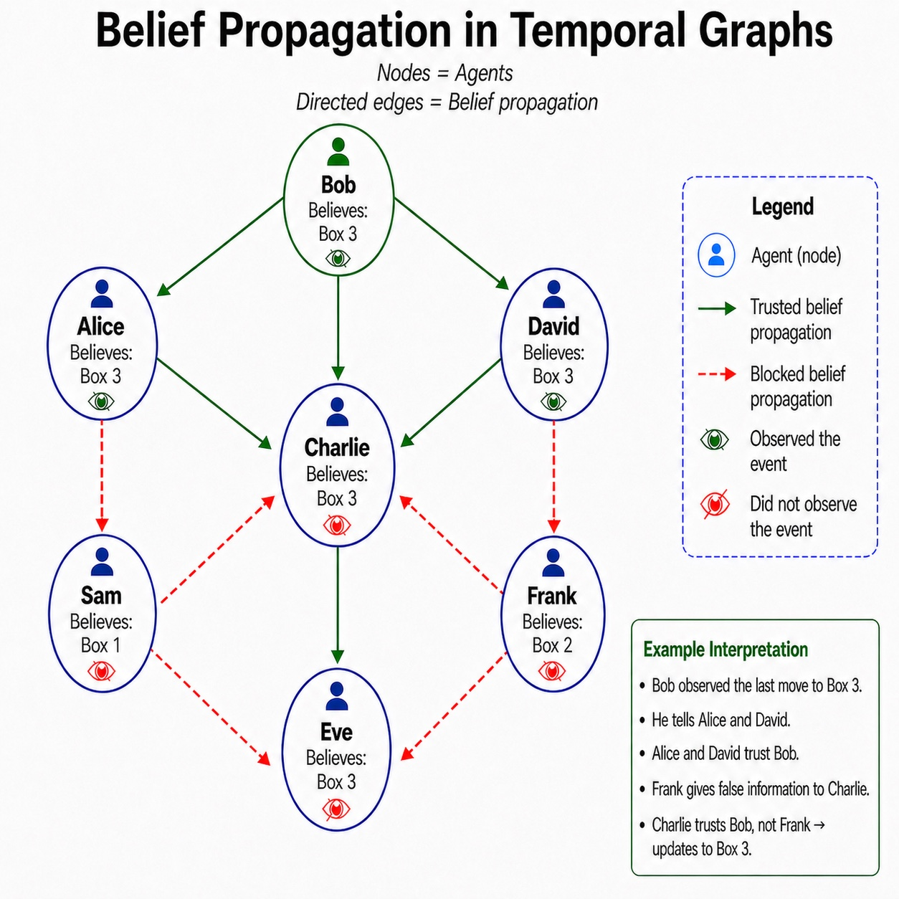

# TemporalGraph-ToM (TGToM)

A benchmark for higher-order theory-of-mind reasoning with temporal belief
propagation across multiple agents. 1k multi-agent stories, 12 question
types per story across four reasoning categories. Includes the
Temporal Causal Belief Graph (TCBG) framework. Extended abstract: [Evaluating Theory-of-Mind Reasoning with Temporal Belief Graphs](docs/Extended_Abstract_TGToM.pdf) TBG improves temporal belief tracking and mitigates reality bias, outperforming CoT in preliminary tests.

##



## Quickstart

```bash
python gen_v10.py                        # generate stories
python higher_order_beliefs_v10.py       # Q0–Q3
python counterfactual_beliefs_v10.py     # Q5–Q7, Q10
python causal_beliefs_v10.py             # Q8
python common_knowledge_v10.py           # Q9, Q11, Q13
python verify_v10.py                     # forward verifier
python verify_graph_v10.py               # graph-based verifier (TBG)
python score_v10.py predictions.jsonl    # grade model predictions
python analyze_dataset_stats_v10.py      # dataset descriptive stats
python tbg_scorer_v10.py --self-test     # TBG prediction scorer
```

Stories are in `stories_v10.jsonl`. Both ground truth verifiers should report 0 mismatches.

## Question categories and types

The 12 questions group into four reasoning categories:

- **Higher-order beliefs** (Q0, Q1, Q2, Q3) — what's true and what each
  agent believes.
- **Counterfactual beliefs** (Q5, Q6, Q7, Q10) — higher order counterfactual beliefs.
- **Causal beliefs** (Q8) — backward attribution: which event caused this
  agent's final belief.
- **Common knowledge** (Q9, Q11, Q13) — whether the location is common
  knowledge in a set of agents.

## File map

### Data

```
stories_v10.jsonl
  1k multi-agent stories.
  → input to all question scripts and verifier scripts.

higher_order_beliefs_v10.jsonl
  Ground truth for Q0 (world state), Q1 (first-order beliefs per agent),
  Q2 (higher-order belief chain — location), Q3 (higher-order chain — intent).
  ← stories_v10.jsonl

counterfactual_beliefs_v10.jsonl
  Ground truth for Q5 (drop a move), Q6 (swap a comm's claim), Q7 (flip a
  move's motive), Q10 (swap two agents' exit times).
  ← stories_v10.jsonl, higher_order_beliefs_v10.jsonl

causal_beliefs_v10.jsonl
  Ground truth for Q8 (causal belief / belief inertia) — which event caused this agent's
  final belief).
  ← stories_v10.jsonl, higher_order_beliefs_v10.jsonl

common_knowledge_v10.jsonl
  Ground truth for Q9 (CK without perturbation), Q11 (CK with exit perturbation),
  Q13 (CK with comm perturbation).
  ← stories_v10.jsonl, higher_order_beliefs_v10.jsonl
```

### Scripts

```
gen_v10.py
  Story generator. Samples 1k stories from a fixed seed (SEED=0). Each
  story has 6–8 agents, a single tracked object, placement / move /
  communication / exit events.
  → stories_v10.jsonl

higher_order_beliefs_v10.py
  Generates Q0–Q3 ground truth. Uses the forward verifier to derive
  the event timeline, then samples chains for Q2/Q3 from a question
  seed.
  ← stories_v10.jsonl  → higher_order_beliefs_v10.jsonl

counterfactual_beliefs_v10.py
  Generates Q5/Q6/Q7/Q10 ground truth. For each perturbation type, attempts
  a targeted search for configurations that change the answer;
  falls back to random selection.
  ← stories_v10.jsonl, higher_order_beliefs_v10.jsonl
  → counterfactual_beliefs_v10.jsonl

causal_beliefs_v10.py
  Generates Q8 ground truth. For a randomly chosen agent, finds the latest
  event the agent witnessed (move/place) or trusted (comm) — that event is
  the cause of their final belief.
  ← stories_v10.jsonl, higher_order_beliefs_v10.jsonl
  → causal_beliefs_v10.jsonl

common_knowledge_v10.py
  Generates Q9/Q11/Q13 ground truth. Tests whether the location is common
  knowledge among a randomly chosen agent set, with no perturbation (Q9)
  or under a counterfactual exit (Q11) or comm-swap (Q13) perturbation.
  ← stories_v10.jsonl, higher_order_beliefs_v10.jsonl
  → common_knowledge_v10.jsonl

verify_v10.py
  Line-by-line forward verifier. Re-derives Q0–Q3 ground truth by parsing
  each story line and applying the witness/trust rules in a single pass;
  reports any mismatches with higher_order_beliefs_v10.jsonl.
  ← stories_v10.jsonl, higher_order_beliefs_v10.jsonl

verify_graph_v10.py
  Graph-based independent verifier — implements the Temporal Belief Graph
  (TBG) scaffold as executable code. Builds per-(agent, time_step) belief
  states and propagates updates; cross-checks all 12 questions.
  ← stories_v10.jsonl, all four question files

score_v10.py
  Scorer. Grades a model's predictions against ground truth. Per-question
  accuracy, per-trial breakdown (--trials N), targeted vs random
  (--by-targeted), per chain depth (--by-chain-depth).
  ← predictions.jsonl  → scored_<predictions>.jsonl

analyze_dataset_stats_v10.py
  Descriptive stats over the dataset. Reports story counts, agent / object /
  container counts, event-type distributions, intent distributions, per-
  question targeted rates, per-question chain-depth distributions, etc.
  ← all data files

tbg_scorer_v10.py
  Scores predicted temporal belief graphs against ground truth.
  Reports four graph metrics: Final Node Accuracy, Time-Respecting Node Accuracy,
  Edge F1 (Temporal and Static), Normalized Structural Distance.
  ← predictions.jsonl, stories_v10.jsonl
```

### Documentation

```
docs/design.md                  story parameters and design
docs/changelog.md               version history

```

## Reproducibility

All scripts are deterministic. `gen_v10.py` uses a single seed (SEED=0) for
story generation. The question scripts use per-(question_type, story_id)
seeds so that adding / removing / reordering questions does not affect other
questions' answers. Per-question seed offsets:

| Question | Offset |
|---|---|
| Q2 | 30000 |
| Q3 | 30100 |
| Q5 | 50000 |
| Q6 | 60000 |
| Q7 | 70000 |
| Q8 | 80000 |
| Q9 | 90000 |
| Q10 | 100000 |
| Q11 | 110000 |
| Q13 | 130000 |

Each question's RNG is `random.Random(offset + story_id)`. Re-running with
the same input produces byte-identical output.

## Two independent verifiers

Ground truth is calculated in two ways:

- `verify_v10.py` — line-by-line forward parser.
- `verify_graph_v10.py` — builds an explicit per-(agent, time_step) temporal belief
  graph and propagates beliefs through it. This is the TBG reasoning scaffold.

Both implementations apply the same witness and trust rules but use different computations. 
They should agree on the ground truth; disagreement flags a bug. 
Both currently report 0 mismatches across all 12 questions.
